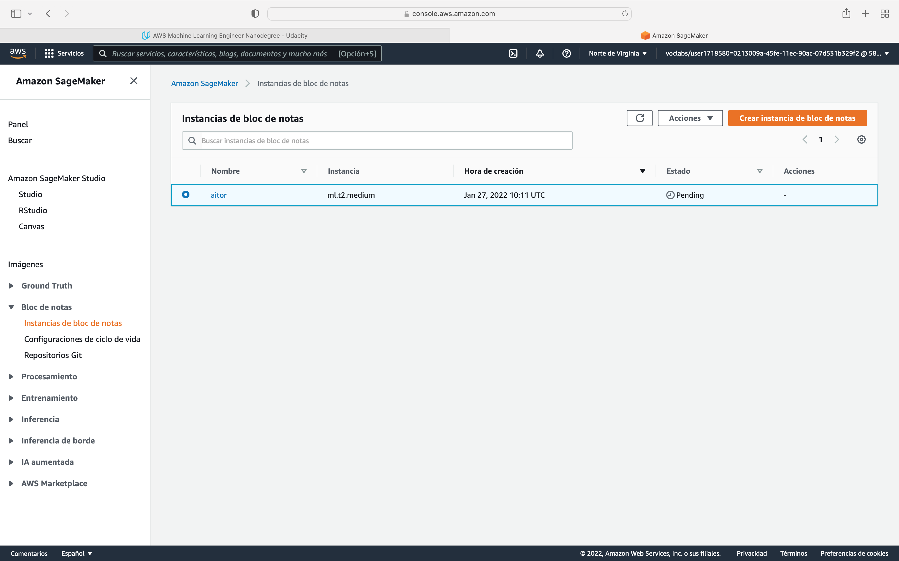
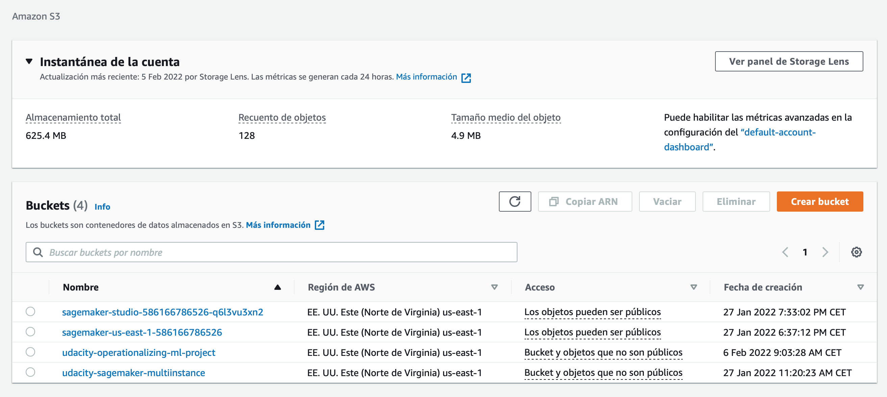
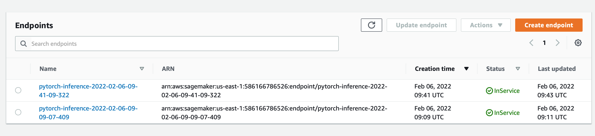
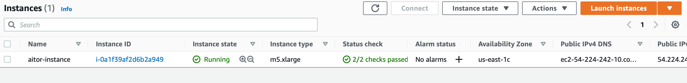
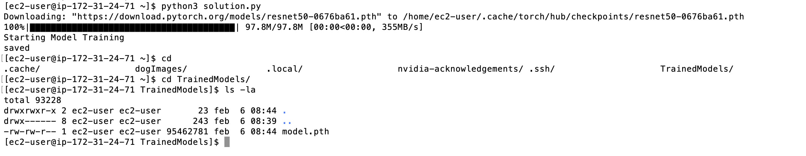
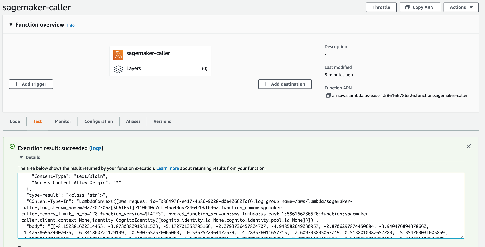
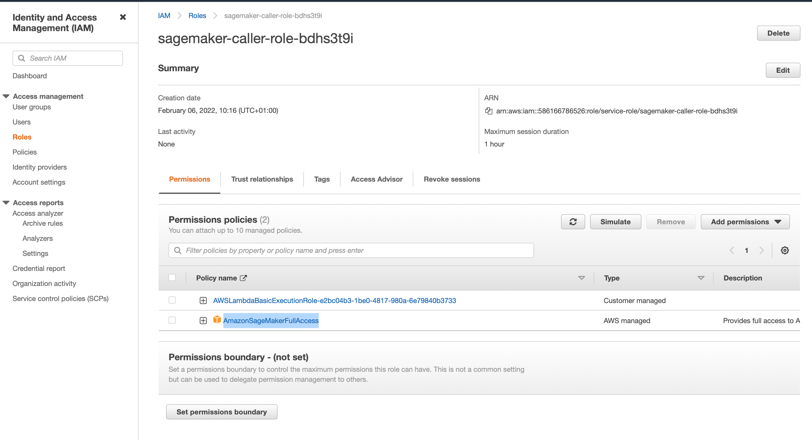
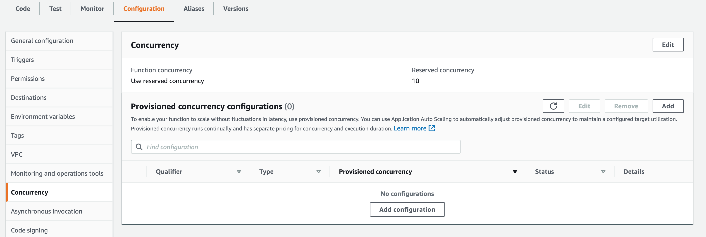
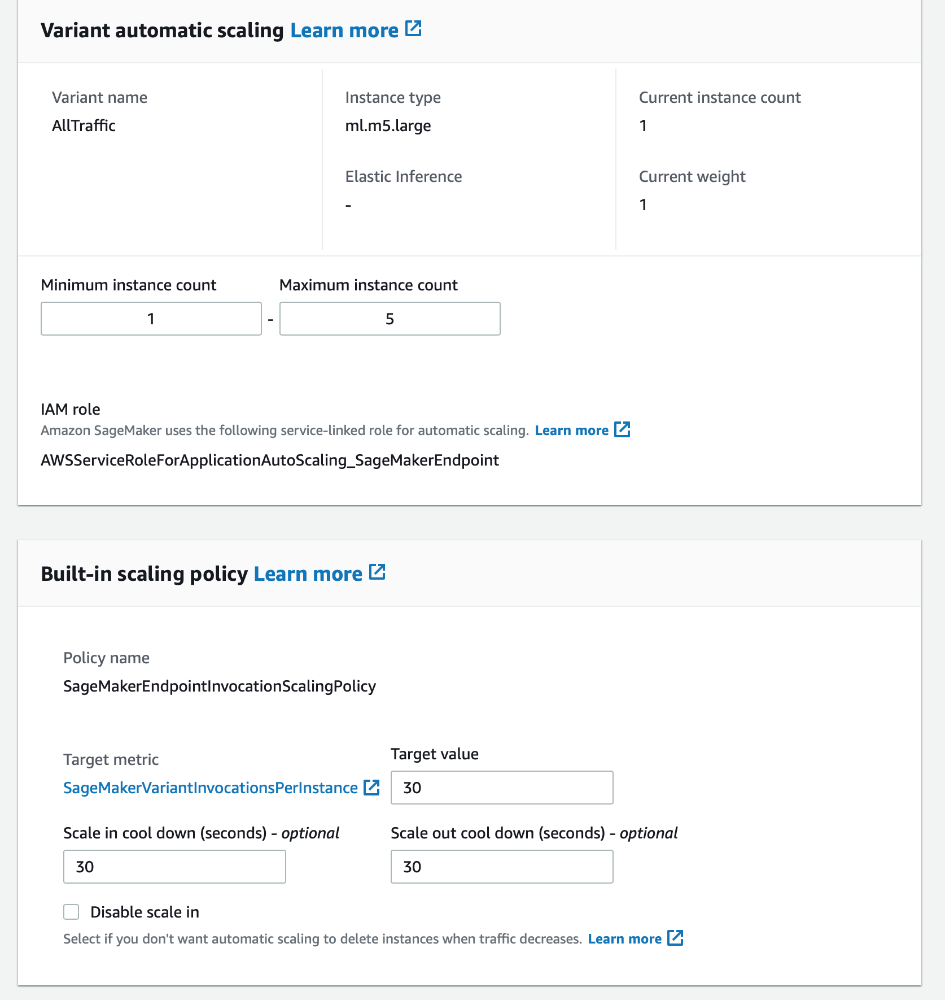

# Operationalizing an AWS ML Project

## Training and deployment using Sagemaker

In this case, I have created a notebook intance whose type is `ml.t2.medium`. I have chosen this instance type because it fits the AWS free tier so we won't be charged. In addition, the CPU and memory resurces provided by this instance are enough for our task, as we are only using the notebook to launch training jobs in different instances with higher computational resources. 



Then, the bucket is created as can be seen here:



Here is an image with the endpoints deployed. One is for the training job I performed with one instance and the other for the training job I performed with 5 instances:



## Training and deployment using EC2

In this case, I have chosen a `m5.xlarge` instance, because the model will be trained on the instance itself and we need enough computational resources for the model to be trained on an acceptable time. `m5.xlarge` instances have a cost of 0.192 USD and provide us with 4 vCPU and 16 GB of RAM which are adequate for the type of training we are performing here.



Regarding the code, it can be seen that the one used on the notebook instance is pretty similar to the one prepared for the EC2. The main differences are:

* The number of epochs: `50` on the notebook and `5` on the EC2.
* Batch size: the notebook is prepared to receive this as an input while on the EC2 code is set to `2`
* Learning rate: the notebook is prepared to recieve this as an input while on the EC2 code is set to `1e-4`

Here is the output of the training process:



## Lambda function

The code of the lambda is very simple. It receieves the input (`event`) and call the sagemaker endpoint with the input given provided by the user. Then the lambda will return a dictionary which will contain the result of the endpoint invocation in the `body` field. 

In order the lambda to work, we have attached to its role the `AmazonSageMakerFullAccess` policy.

The lambda is invoked with the provided example and here is an screenshot:



The output is the following one:

```json
{
  "statusCode": 200,
  "headers": {
    "Content-Type": "text/plain",
    "Access-Control-Allow-Origin": "*"
  },
  "type-result": "<class 'str'>",
  "COntent-Type-In": "LambdaContext([aws_request_id=f6bea79d-e571-4300-99ce-bfed01b9d365,log_group_name=/aws/lambda/sagemaker-caller,log_stream_name=2022/02/06/[$LATEST]bb81bcfa0d1244d3a3ba2b9cd986f551,function_name=sagemaker-caller,memory_limit_in_mb=128,function_version=$LATEST,invoked_function_arn=arn:aws:lambda:us-east-1:586166786526:function:sagemaker-caller,client_context=None,identity=CognitoIdentity([cognito_identity_id=None,cognito_identity_pool_id=None])])",
  "body": "[[-9.4320650100708, -3.7449491024017334, -3.9482009410858154, -0.6375613808631897, -5.006299018859863, -7.510648250579834, -1.7620785236358643, -2.5927250385284424, -8.338700294494629, -1.1991328001022339, -2.482064962387085, -3.7442095279693604, -2.88450288772583, -0.8836660981178284, -4.075363636016846, -2.067305326461792, -5.489211082458496, -3.430907726287842, -4.912317276000977, -1.3692591190338135, -5.062955856323242, -2.5599851608276367, -6.356449604034424, -4.69893741607666, -4.905820846557617, -8.98274040222168, -2.271939754486084, -6.2952494621276855, -6.577883720397949, -3.5116677284240723, -3.633715867996216, -4.827742576599121, -7.269776821136475, -2.7234864234924316, -7.020397663116455, -6.216109752655029, -5.145767688751221, -3.776970863342285, -1.0883530378341675, -3.5138323307037354, -3.0998690128326416, -2.973536252975464, -1.612802505493164, -4.439108371734619, -0.42046332359313965, -9.211479187011719, -3.196627616882324, -1.756482481956482, -2.941706895828247, -2.3259410858154297, -5.074997425079346, -7.953185558319092, -6.788286209106445, -4.061253547668457, -6.586802005767822, -1.4537994861602783, -3.4453608989715576, -7.034312725067139, -3.67707896232605, -3.110520601272583, -6.551329612731934, -6.681034564971924, -7.565070152282715, -8.187239646911621, -3.810312032699585, -7.905596733093262, 0.049617961049079895, -8.814532279968262, -3.474682092666626, -1.6886463165283203, -1.2665311098098755, -5.105802059173584, -5.589840888977051, -5.480544090270996, -6.497171878814697, -3.7852976322174072, -7.1317667961120605, -2.099222421646118, -8.078211784362793, -4.5812835693359375, -1.0993131399154663, -6.638916492462158, -2.8713133335113525, -1.834686517715454, -8.400838851928711, -6.20582914352417, -2.517054557800293, -6.1942362785339355, -4.74722957611084, -0.3839942216873169, -6.934844493865967, -6.966168403625488, -5.587225437164307, -5.803734302520752, -4.499310493469238, -4.317468166351318, -4.246484756469727, -4.8492279052734375, -6.277413845062256, -6.660984039306641, -7.63154935836792, -3.9838879108428955, -4.521168231964111, -5.390734672546387, -3.9409902095794678, -7.307709693908691, -3.1689860820770264, -1.5761159658432007, -2.6550540924072266, -2.6809537410736084, -2.3301329612731934, -1.002718448638916, -7.194186210632324, -6.032125949859619, -6.399385452270508, -1.61276376247406, -9.710225105285645, -1.299355149269104, -5.91879415512085, -0.4316354990005493, -2.1729941368103027, -3.0173633098602295, -5.854046821594238, -4.2112908363342285, -5.513102054595947, -5.43998908996582, -2.863527297973633, -2.84613299369812, -7.297392845153809, -4.759398937225342, -7.610898017883301, -1.417481541633606, -3.9379096031188965]]"
}
```

Here is a screenshot of the policies attached to the lambda:



As can be seen, the lambda has two policies attached. The first one allows the lambda to be executed properly. The second one allows the lambda to call the endpoint. However, the last policy is very permissive as it also allows the lambda to invoke many other actions in SageMaker such as creating notebook instances or generating new training jobs. The most appropriate thing here is to create a custom policy which will allow the lambda only to call the endpoint we have created. This would be a valid example for our case:

```json
{
    "Version": "2012-10-17",
    "Statement": [
        {
            "Sid": "VisualEditor0",
            "Effect": "Allow",
            "Action": "sagemaker:InvokeEndpoint",
            "Resource": "arn:aws:sagemaker:us-east-1:586166786526:endpoint/pytorch-inference-2022-02-06-09-09-07-409"
        }
    ]
}
```

In the IAM console we can see other roles which should me monitorized and deleted in case of not being used by resources we have created. 

## Concurrency

As can be seen in the following image, I have set up a reserved concurrency of `10` for the lambda. This type of concurrency is the best in our case as it does not generate extra cost and we can ensure that the lambda can be invoked 10 times at the same time. Provisioned concurrency is very valuable when we want to reduce to the minimum the amount of time a request takes, as all the instances are pre-warmed before the first call.




On the other hand, we have set up an autoscaling policy for out SageMaker endpoint. In my case I have set up a maximum of 5 instances with a cool down period of 30 seconds for both scale in and scale down. The target value in this case is 30 so when more than 30 requests are made in the cool down period, an extra instance will be added. Accordingly, when the number of requests decrease, the number of instances will be reduced, allowing us to save costs.




